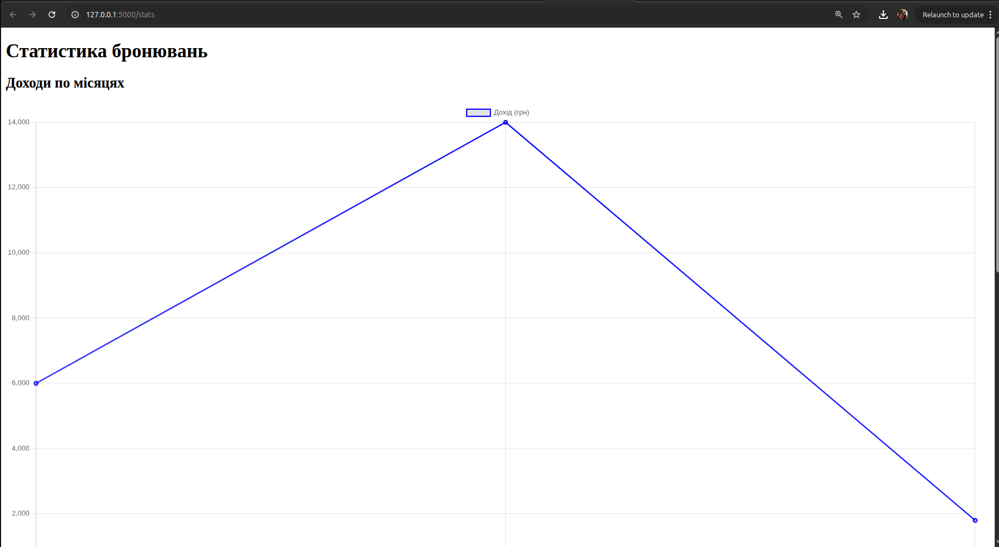
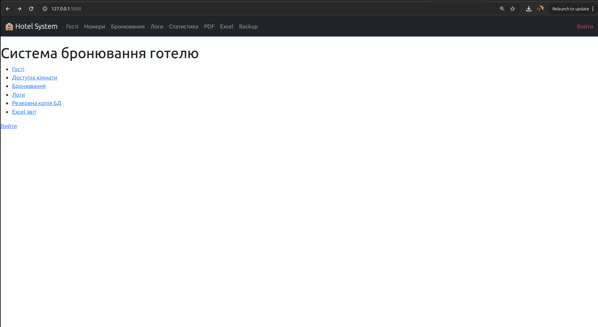
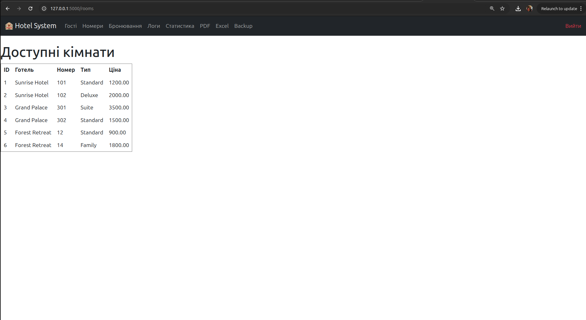
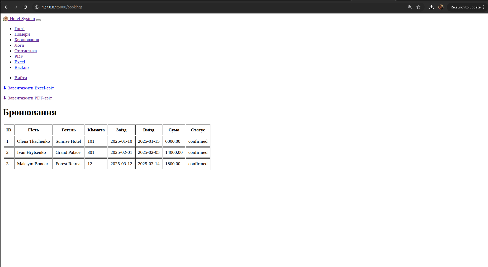
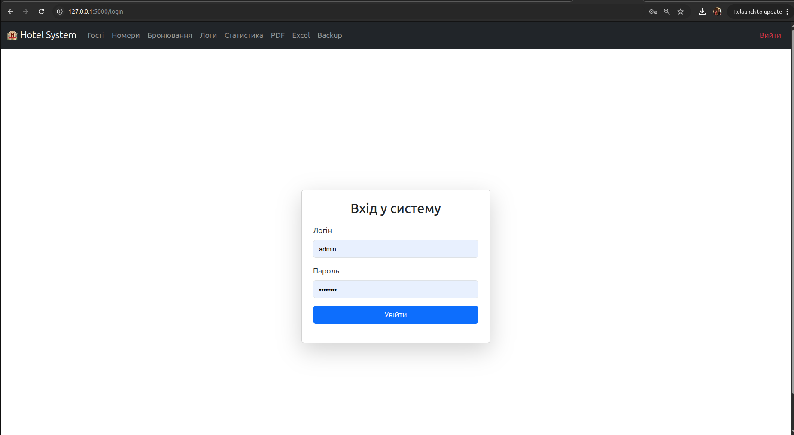
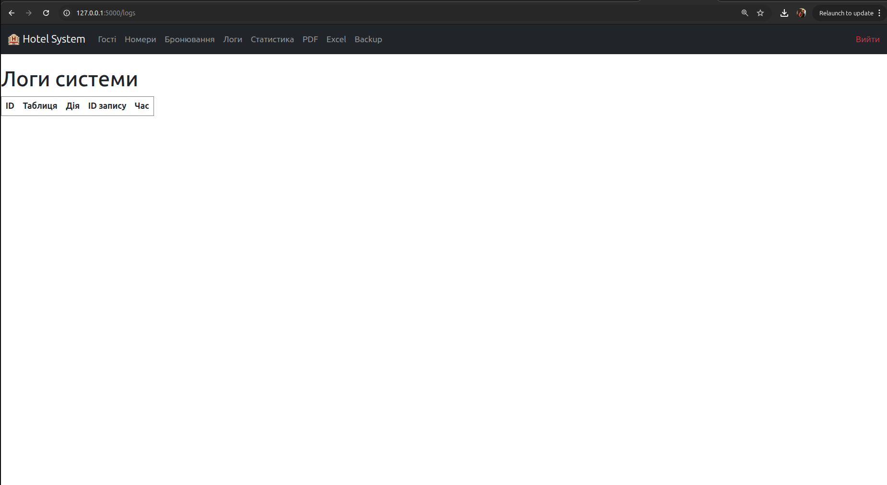

# Звіт з лабораторної роботи №4

## Загальна інформація
- **ПІБ студента:** Ткачук Евеліна Олександрівна
- **Група:** ІПЗ-32
- **Варіант (предметна область):** Система бронювання готелів
- **Рівень виконання:** 1 + 2 + 3 рівні

---

## Опис предметної області
Система бронювання готелів автоматизує процеси управління готелями, номерами, гостями та бронюваннями.  
Вона містить:
- базу гостей;
- інформацію про готелі та номери;
- модуль бронювання;
- логування дій;
- статистику та аналітику;
- генерацію PDF / Excel звітів;
- REST API;
- вебінтерфейс із ролями.


## Логічна схема
Основні таблиці:
- guests  
- hotels  
- rooms  
- bookings  
- users  
- logs  

Додаткові об'єкти:
- VIEW available_rooms  
- VIEW booking_details  
- тригери update_room_status, add_log  

---

## Реалізація в PostgreSQL
Таблиці, тригери та view створені відповідно до логічної моделі.

---

## Налаштування Docker
Проєкт працює у двох контейнерах:
- PostgreSQL
- pgAdmin4

Запуск:
```bash
docker compose up -d
```

---

## SQL-запити
Реалізовано:
- отримання доступних кімнат
- перегляд логів
- аналітика доходів
- аналітика бронювань
- деталі бронювань

---

## Вебзастосунок

### 📊 1. Сторінка статистики  
URL: http://127.0.0.1:5000/stats  


---

### 🏠 2. Головна сторінка  
URL: http://127.0.0.1:5000/  


---

### 🛏 3. Сторінка номерів  
URL: http://127.0.0.1:5000/rooms  


---

### 👤 4. Сторінка гостей  
URL: http://127.0.0.1:5000/guests  


---

### 📚 5. Сторінка бронювань  
URL: http://127.0.0.1:5000/bookings  


---

### 🔐 6. Сторінка логіну  
URL: http://127.0.0.1:5000/login  


---

### 📜 7. Сторінка логів  
URL: http://127.0.0.1:5000/logs  


---

## Розширена функціональність (рівень 3)
Реалізовано:
- авторизація та ролі користувачів;
- тригер логування;
- REST API (GET/POST/DELETE);
- статистичні графіки (Chart.js);
- PDF-звіти (reportlab);
- Excel-звіти (openpyxl);
- резервне копіювання БД;
- сучасний інтерфейс на Bootstrap 5.

---

## Висновки
У ході роботи створено повноцінну систему бронювання готелів, яка включає базу даних, вебінтерфейс, API, аналітику, логування та генерацію звітів.  
Виконано всі вимоги 1, 2 та 3 рівня складності.


